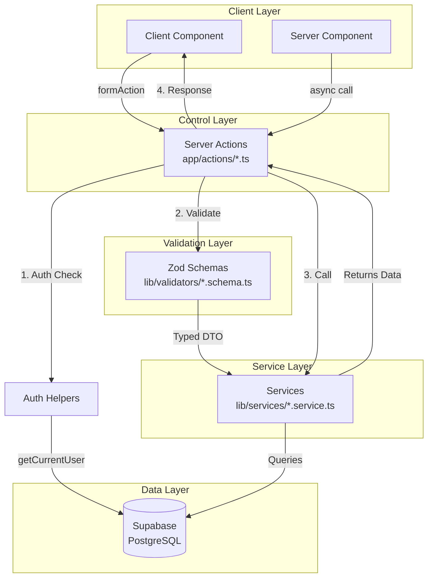
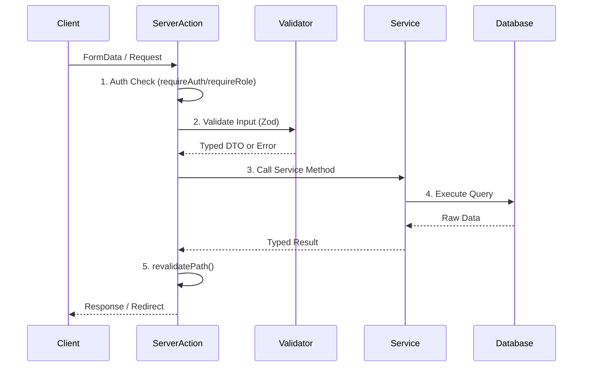

# 🎓 n.training

<div align="center">


**Professional training platform powered by [ness.](https://ness.com.br)**

Plataforma de treinamento de Segurança da Informação com arquitetura em camadas.

[🚀 Getting Started](#-getting-started) • [📚 Documentation](#-documentation) • [🏗️ Architecture](#️-architecture) • [🛠️ Development](#️-development)

</div>

---

## 📋 Table of Contents

- [Overview](#-overview)
- [Tech Stack](#-tech-stack)
- [Architecture](#️-architecture)
- [Project Structure](#-project-structure)
- [Getting Started](#-getting-started)
- [Environment Variables](#-environment-variables)
- [Development Guide](#-development-guide)
- [Deployment](#-deployment)
- [License](#-license)

---

## 🎯 Overview

**n.training** é uma plataforma completa de treinamento corporativo focada em Segurança da Informação. Desenvolvida com Next.js 14 (App Router) e TypeScript, utiliza uma arquitetura em camadas (Service Layer + Repository Pattern simplificado) para garantir código limpo, testável e manutenível.

### ✨ Key Features

- 🎓 **Gestão de Cursos**: Criação, edição e publicação de cursos com módulos e aulas
- 👥 **Gestão de Usuários**: Sistema de aprovação, roles e organizações
- 📊 **Dashboard Administrativo**: Métricas e relatórios em tempo real
- 🎯 **Quizzes Interativos**: Sistema completo de avaliações com múltiplas tentativas
- 📜 **Certificados PDF**: Geração automática de certificados em PDF
- 🔔 **Notificações Inteligentes**: Sistema de notificações com rate limiting
- 🌐 **Multi-tenant**: Suporte a múltiplas organizações
- 🔐 **Autenticação Robusta**: Sistema de autenticação com aprovação de administradores

---

## 🛠️ Tech Stack

### Core

| Technology | Version | Purpose |
|------------|---------|---------|
| **Next.js** | 14.2.0 | React framework com App Router |
| **TypeScript** | 5.5.0 | Type safety e developer experience |
| **React** | 18.3.0 | UI library |
| **Tailwind CSS** | 3.4.4 | Utility-first CSS framework |

### Backend & Database

| Technology | Version | Purpose |
|------------|---------|---------|
| **Supabase** | 2.39.0 | PostgreSQL database + Auth + Storage |
| **@supabase/ssr** | 0.7.0 | Server-side rendering support |

### Validation & Forms

| Technology | Version | Purpose |
|------------|---------|---------|
| **Zod** | 4.1.12 | Schema validation |
| **React Hook Form** | - | Form state management |

### UI Components

| Technology | Version | Purpose |
|------------|---------|---------|
| **shadcn/ui** | Latest | Accessible component library |
| **Radix UI** | Various | Headless UI primitives |
| **Lucide React** | 0.400.0 | Icon library |

### Additional Libraries

| Technology | Version | Purpose |
|------------|---------|---------|
| **@react-pdf/renderer** | 4.3.1 | PDF certificate generation |
| **Resend** | 6.5.2 | Email service |
| **@dnd-kit** | 6.3.1 | Drag-and-drop for reordering |
| **date-fns** | 4.1.0 | Date manipulation |
| **Sonner** | 2.0.7 | Toast notifications |

---

## 🏗️ Architecture

### Layered Architecture Pattern

O projeto segue uma arquitetura em **3 camadas** para separação clara de responsabilidades:



### Flow Diagram



### Golden Rules

1. **Validation Layer** (`lib/validators/[modulo].schema.ts`)
   - ✅ Usa Zod para validação
   - ✅ Exporta schemas e tipos inferidos
   - ✅ Sanitiza inputs de busca (previne SQL Injection)

2. **Service Layer** (`lib/services/[modulo].service.ts`)
   - ✅ **NUNCA** recebe `FormData`
   - ✅ **NUNCA** usa `redirect()` ou `revalidatePath()`
   - ✅ Recebe apenas objetos tipados (DTOs)
   - ✅ Retorna dados puros ou lança erros tipados
   - ✅ Contém toda lógica de negócio e queries

3. **Control Layer** (`app/actions/[modulo].ts`)
   - ✅ Orquestra o fluxo: Auth → Validation → Service → Response
   - ✅ Extrai dados de `FormData` (se necessário)
   - ✅ Chama validadores Zod
   - ✅ Chama services
   - ✅ Usa `revalidatePath()` e `redirect()` quando necessário

---

## 📁 Project Structure

```
n.training/
├── app/                          # Next.js App Router
│   ├── (admin)/                  # Admin route group
│   │   └── admin/                # Admin dashboard pages
│   ├── (main)/                   # Main app route group
│   │   ├── courses/              # Course pages
│   │   ├── dashboard/            # User dashboard
│   │   └── profile/              # User profile
│   ├── actions/                  # Server Actions (Control Layer)
│   │   ├── auth.ts               # Authentication actions
│   │   ├── courses.ts            # Course management
│   │   ├── users.ts              # User management
│   │   └── ...                   # Other domain actions
│   ├── auth/                     # Auth pages (login, signup)
│   └── layout.tsx                # Root layout
│
├── components/                   # React components
│   ├── ui/                       # shadcn/ui components
│   ├── admin/                    # Admin-specific components
│   ├── layout/                   # Layout components (Header, Sidebar)
│   └── ...                       # Feature components
│
├── lib/                          # Core libraries
│   ├── auth/                     # Authentication helpers
│   │   ├── context.ts            # AsyncLocalStorage context
│   │   ├── helpers.ts            # Auth functions (getCurrentUser, requireAuth)
│   │   ├── types.ts              # Auth types
│   │   └── index.ts              # Public exports
│   │
│   ├── services/                 # Service Layer (Business Logic)
│   │   ├── auth.service.ts       # Authentication service
│   │   ├── course.service.ts     # Course service
│   │   ├── user.service.ts       # User service
│   │   ├── content.service.ts    # Modules & Lessons service
│   │   ├── quiz.service.ts       # Quiz service
│   │   └── organization.service.ts # Organization service
│   │
│   ├── validators/               # Validation Layer (Zod Schemas)
│   │   ├── auth.schema.ts        # Auth validation
│   │   ├── course.schema.ts      # Course validation
│   │   ├── user.schema.ts        # User validation
│   │   ├── content.schema.ts     # Module & Lesson validation
│   │   ├── quiz.schema.ts        # Quiz validation
│   │   └── organization.schema.ts # Organization validation
│   │
│   ├── supabase/                 # Supabase configuration
│   │   ├── server.ts             # Server client (with compatibility wrappers)
│   │   ├── database.types.ts     # Generated types
│   │   └── migrations/           # SQL migrations
│   │
│   ├── types/                    # TypeScript types
│   │   └── database.ts           # Database entity types
│   │
│   ├── certificates/             # PDF certificate generation
│   ├── email/                    # Email templates (Resend)
│   ├── notifications/            # Notification system
│   ├── utils/                    # Utility functions
│   └── ...                       # Other utilities
│
├── public/                       # Static assets
├── scripts/                      # Utility scripts
└── package.json                  # Dependencies
```

### Key Directories Explained

| Directory | Purpose | Example Files |
|-----------|---------|---------------|
| `app/actions/` | Server Actions (orchestration only) | `auth.ts`, `courses.ts` |
| `lib/services/` | Business logic & database queries | `course.service.ts` |
| `lib/validators/` | Zod schemas for validation | `course.schema.ts` |
| `lib/auth/` | Authentication helpers | `helpers.ts`, `context.ts` |
| `lib/supabase/` | Supabase client & config | `server.ts`, `migrations/` |
| `components/ui/` | Reusable UI components | `button.tsx`, `card.tsx` |

---

## 🚀 Getting Started

### Prerequisites

- **Node.js** 18+ (recomendado: 20+)
- **npm** ou **yarn**
- Conta no **Supabase** (para banco de dados)
- Conta no **Vercel** (para deploy, opcional)

### Installation

1. **Clone o repositório**
   ```bash
   git clone <repository-url>
   cd nTraining
   ```

2. **Instale as dependências**
   ```bash
   npm install
   ```

3. **Configure as variáveis de ambiente**
   ```bash
   cp .env.example .env.local
   ```
   
   Edite `.env.local` e adicione suas credenciais do Supabase (veja [Environment Variables](#-environment-variables)).

4. **Execute o servidor de desenvolvimento**
   ```bash
   npm run dev
   ```

5. **Acesse a aplicação**
   - Abra [http://localhost:3000](http://localhost:3000) no navegador

### First-Time Setup

1. **Criar banco de dados no Supabase**
   - Execute as migrations em `lib/supabase/migrations/` na ordem numérica
   - Configure RLS (Row Level Security) policies conforme necessário

2. **Criar usuário superadmin**
   - Use o script `scripts/create-user.ts` ou crie manualmente no Supabase Dashboard
   - Defina `is_superadmin = true` no registro do usuário

3. **Configurar Resend (opcional, para emails)**
   - Adicione `RESEND_API_KEY` no `.env.local`
   - Configure domínio verificado no Resend Dashboard

---

## 🔐 Environment Variables

### Required Variables

| Variable | Description | Example | Where to Get |
|----------|-------------|---------|--------------|
| `NEXT_PUBLIC_SUPABASE_URL` | URL do projeto Supabase | `https://xxx.supabase.co` | Supabase Dashboard → Settings → API |
| `NEXT_PUBLIC_SUPABASE_ANON_KEY` | Chave anônima (pública) | `eyJhbGc...` | Supabase Dashboard → Settings → API |
| `SUPABASE_SERVICE_ROLE_KEY` | Chave service role (privada) | `eyJhbGc...` | Supabase Dashboard → Settings → API → service_role |

### Optional Variables

| Variable | Description | Default | Required For |
|----------|-------------|---------|--------------|
| `NEXT_PUBLIC_APP_URL` | URL da aplicação | `http://localhost:3000` | Email redirects, OAuth callbacks |
| `RESEND_API_KEY` | API key do Resend | - | Envio de emails |
| `OPENAI_API_KEY` | API key do OpenAI | `sk-...` | Geração de cursos com IA |
| `HELICONE_API_KEY` | API key do Helicone (opcional) | `sk-...` | Observabilidade e cache de IA |

### Environment File Example

```env
# Supabase Configuration
NEXT_PUBLIC_SUPABASE_URL=https://your-project.supabase.co
NEXT_PUBLIC_SUPABASE_ANON_KEY=your_anon_key_here
SUPABASE_SERVICE_ROLE_KEY=your_service_role_key_here

# Next.js
NEXT_PUBLIC_APP_URL=http://localhost:3000

# Resend (Optional)
RESEND_API_KEY=re_your_api_key_here

# OpenAI & Helicone (AI Course Architect)
OPENAI_API_KEY=sk-your_openai_api_key_here
HELICONE_API_KEY=sk-your_helicone_api_key_here  # Optional: for observability and caching
```

### ⚠️ Security Notes

- **NUNCA** commite `.env.local` no Git
- `SUPABASE_SERVICE_ROLE_KEY` é **PRIVADA** - use apenas server-side
- `NEXT_PUBLIC_*` variáveis são expostas ao cliente - não inclua secrets

---

## 🛠️ Development Guide

### Creating a New Feature

Seguindo o padrão **Service Layer + Validation Layer**, aqui está um exemplo completo:

#### 1. Create Validation Schema

**File:** `lib/validators/example.schema.ts`

```typescript
import { z } from 'zod'

export const ExampleCreateSchema = z.object({
  title: z.string().min(3, 'Título deve ter pelo menos 3 caracteres'),
  description: z.string().optional(),
  status: z.enum(['draft', 'published']).default('draft'),
})

export type ExampleCreateInput = z.infer<typeof ExampleCreateSchema>

export function validateExampleCreate(data: unknown): ExampleCreateInput {
  return ExampleCreateSchema.parse(data)
}
```

#### 2. Create Service

**File:** `lib/services/example.service.ts`

```typescript
import { createClient } from '@/lib/supabase/server'
import type { ExampleCreateInput } from '@/lib/validators/example.schema'

export class ExampleServiceError extends Error {
  constructor(message: string, public code?: string) {
    super(message)
    this.name = 'ExampleServiceError'
  }
}

export class ExampleService {
  private supabase = createClient()

  async createExample(input: ExampleCreateInput) {
    const { data, error } = await this.supabase
      .from('examples')
      .insert(input)
      .select()
      .single()

    if (error) {
      throw new ExampleServiceError(
        `Erro ao criar exemplo: ${error.message}`,
        'CREATE_ERROR'
      )
    }

    return data
  }
}
```

#### 3. Create Server Action

**File:** `app/actions/examples.ts`

```typescript
'use server'

import { revalidatePath } from 'next/cache'
import { requireRole } from '@/lib/auth/helpers'
import { ExampleService, ExampleServiceError } from '@/lib/services/example.service'
import { validateExampleCreate } from '@/lib/validators/example.schema'
import { ZodError } from 'zod'

export async function createExample(formData: FormData) {
  try {
    // 1. Auth Check
    await requireRole('platform_admin')

    // 2. Extract & Validate
    const rawInput = {
      title: formData.get('title') as string,
      description: formData.get('description') as string,
      status: formData.get('status') as string,
    }

    const validatedInput = validateExampleCreate(rawInput)

    // 3. Service Call
    const service = new ExampleService()
    const result = await service.createExample(validatedInput)

    // 4. Response/Effect
    revalidatePath('/admin/examples')
    return { success: true, data: result }
  } catch (error) {
    if (error instanceof ExampleServiceError) {
      return { success: false, error: error.message }
    }
    if (error instanceof ZodError) {
      return { success: false, error: 'Dados inválidos' }
    }
    throw error
  }
}
```

#### 4. Use in Component

```typescript
'use client'

import { createExample } from '@/app/actions/examples'

export function ExampleForm() {
  async function handleSubmit(formData: FormData) {
    const result = await createExample(formData)
    if (result.success) {
      // Success!
    } else {
      // Show error
    }
  }

  return (
    <form action={handleSubmit}>
      {/* Form fields */}
    </form>
  )
}
```

### Available Scripts

| Script | Command | Description |
|--------|---------|-------------|
| **Dev** | `npm run dev` | Inicia servidor de desenvolvimento |
| **Build** | `npm run build` | Cria build de produção |
| **Start** | `npm run start` | Inicia servidor de produção |
| **Lint** | `npm run lint` | Executa ESLint |
| **Import Course** | `npm run import:course -- <file>` | Importa curso de JSON |

---

## 🚢 Deployment

### Vercel (Recomendado)

1. **Conecte o repositório ao Vercel**
   - Acesse [vercel.com](https://vercel.com)
   - Importe o repositório Git

2. **Configure variáveis de ambiente**
   - Vá em **Settings** → **Environment Variables**
   - Adicione todas as variáveis listadas em [Environment Variables](#-environment-variables)
   - Selecione os ambientes (Production, Preview, Development)

3. **Deploy**
   - O Vercel faz deploy automático a cada push para `main`
   - Ou faça deploy manual: `vercel --prod`

### Manual Build

```bash
# Build
npm run build

# Start production server
npm run start
```

---

## 📚 Additional Documentation

- **[DOCUMENTACAO_TECNICA.md](./DOCUMENTACAO_TECNICA.md)** - Documentação técnica completa
- **[PLANO_LIMPEZA.md](./PLANO_LIMPEZA.md)** - Plano de limpeza e refatoração
- **[REFACTORING_SUMMARY.md](./REFACTORING_SUMMARY.md)** - Resumo da refatoração para Service Layer

---

## 📄 License

Private project - [ness.](https://ness.com.br)

---

<div align="center">

**Built with ❤️ by [ness.](https://ness.com.br)**

[Website](https://ness.com.br) • [Documentation](./DOCUMENTACAO_TECNICA.md) • [Support](#)

</div>
